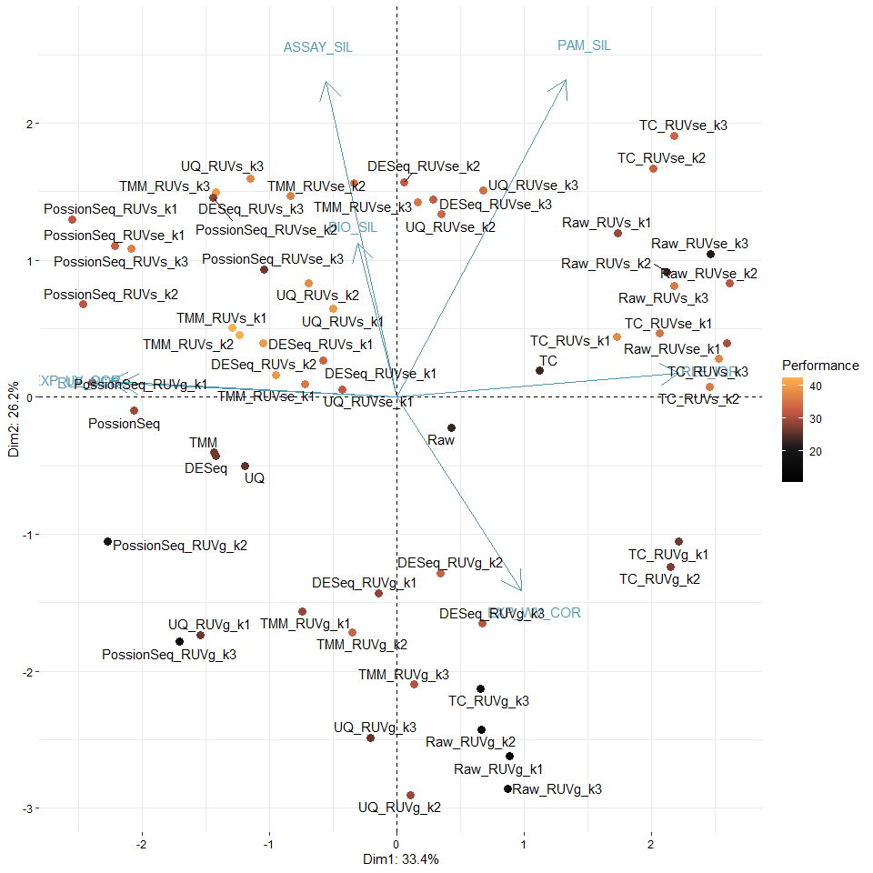
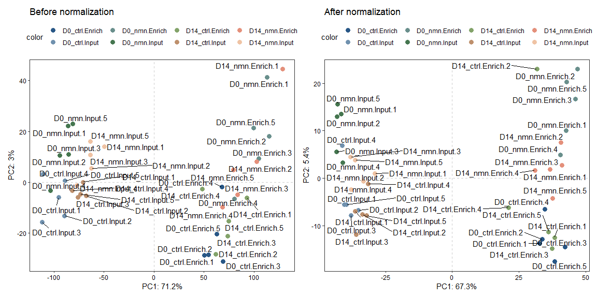
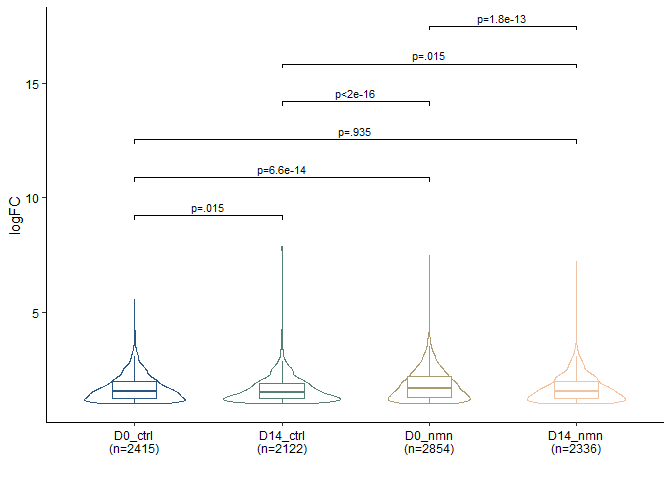

<!-- README.md is generated from README.Rmd. Please edit that file -->

# enONE

<!-- badges: start -->
<!-- badges: end -->

enONE is an R package for performing spike-in based normalization on
NAD-capped RNA sequencing data, as well as comparing and ranking the
performance of different normalization strategies. enONE also provides a
toolkit to handle NAD-RNA sequencing data.

## Installation

You can install the development version of enONE from
[GitHub](https://github.com/) with:

``` r
# install.packages("devtools")
devtools::install_github("thereallda/enONE")
```

## Workflow

``` r
library(enONE)
library(tidyverse)
library(edgeR)
library(paintingr)
library(patchwork)
library(SummarizedExperiment)
```

### Load data

Metadata including sample information.

``` r
meta <- read.csv('data/metadata.csv', comment.char = '#')
meta
#>     id       condition replicate
#> 1   C1   D0_ctrl.Input         1
#> 2   C2   D0_ctrl.Input         2
#> 3   C3   D0_ctrl.Input         3
#> 4   C4   D0_ctrl.Input         4
#> 5   C5   D0_ctrl.Input         5
#> 6   C6  D14_ctrl.Input         1
#> 7   C7  D14_ctrl.Input         2
#> 8   C8  D14_ctrl.Input         3
#> 9   C9  D14_ctrl.Input         4
#> 10 C10  D14_ctrl.Input         5
#> 11 C11  D0_ctrl.Enrich         1
#> 12 C12  D0_ctrl.Enrich         2
#> 13 C13  D0_ctrl.Enrich         3
#> 14 C14  D0_ctrl.Enrich         4
#> 15 C15  D0_ctrl.Enrich         5
#> 16 C16 D14_ctrl.Enrich         1
#> 17 C17 D14_ctrl.Enrich         2
#> 18 C18 D14_ctrl.Enrich         3
#> 19 C19 D14_ctrl.Enrich         4
#> 20 C20 D14_ctrl.Enrich         5
#> 21  N1    D0_nmn.Input         1
#> 22  N2    D0_nmn.Input         2
#> 23  N3    D0_nmn.Input         3
#> 24  N4    D0_nmn.Input         4
#> 25  N5    D0_nmn.Input         5
#> 26  N6   D14_nmn.Input         1
#> 27  N7   D14_nmn.Input         2
#> 28  N8   D14_nmn.Input         3
#> 29  N9   D14_nmn.Input         4
#> 30 N10   D14_nmn.Input         5
#> 31 N11   D0_nmn.Enrich         1
#> 32 N12   D0_nmn.Enrich         2
#> 33 N13   D0_nmn.Enrich         3
#> 34 N14   D0_nmn.Enrich         4
#> 35 N15   D0_nmn.Enrich         5
#> 36 N16  D14_nmn.Enrich         1
#> 37 N17  D14_nmn.Enrich         2
#> 38 N18  D14_nmn.Enrich         3
#> 39 N19  D14_nmn.Enrich         4
#> 40 N20  D14_nmn.Enrich         5
```

NAD-RNA-Sequencing data, with genes in rows and samples in columns.

``` r
counts.df <- read.csv('data/Counts.csv', row.names = 1)
counts.df[1:3,]
#>                    C1 C2 C3 C4 C5 C6 C7 C8 C9 C10 C11 C12 C13 C14 C15 C16 C17
#> ENSCAFG00845015183  0  0  0  0  0  0  0  0  0   0   0   0   0   0   0   0   0
#> ENSCAFG00845015195  0  0  0  0  0  0  0  0  0   0   0   0   0   0   0   0   0
#> ENSCAFG00845015208  0  0  0  0  0  0  0  0  0   0   0   0   0   0   0   0   0
#>                    C18 C19 C20 N1 N2 N3 N4 N5 N6 N7 N8 N9 N10 N11 N12 N13 N14
#> ENSCAFG00845015183   0   0   0  0  0  0  0  0  0  0  0  0   0   0   0   0   0
#> ENSCAFG00845015195   0   0   0  0  0  0  0  0  0  0  0  0   0   0   0   0   0
#> ENSCAFG00845015208   0   0   0  0  0  0  0  0  0  0  0  0   0   0   0   0   0
#>                    N15 N16 N17 N18 N19 N20
#> ENSCAFG00845015183   0   0   0   0   0   0
#> ENSCAFG00845015195   0   0   0   0   0   0
#> ENSCAFG00845015208   0   0   0   0   0   0
```

### Filtering low-expressed genes

``` r
keep <- filterByExpr(counts.df, group = meta$condition)
counts_keep <- counts.df[keep,]
dim(counts.df); dim(counts_keep)
#> [1] 48735    40
#> [1] 28685    40
```

### Create Enone object

Use “input.id” and “enrich.id” to specify the id of input and enrich
library, which should be the same as `group`. If `group` is
`c("D0_ctrl.Input", "D0_ctrl.Enrich",...)`, then `input.id` = ‘Input’
and `enrich.id` = ‘Enrich’.

`synthetic.id` is a vector specify the ids of synthetic RNA, if
included.

``` r
# set-up
enrich_group <- gsub(".*\\.", "", meta$condition)
spikeInPrefix <- '^FB'
# create Enone
Enone <- createEnone(data = counts_keep,
                     bio.group = meta$condition,
                     enrich.group = enrich_group,
                     batch.group = NULL,
                     spike.in.prefix = spikeInPrefix,
                     synthetic.id = c('Syn1','Syn2'),
                     input.id = "Input",
                     enrich.id = "Enrich"
                     )
Enone
#> class: Enone 
#> dim: 28685 40 
#> metadata(0):
#> assays(1): ''
#> rownames(28685): ENSCAFG00845015217 ENSCAFG00845015316 ... Syn1 Syn2
#> rowData names(3): GeneID SpikeIn Synthetic
#> colnames(40): C1 C2 ... N19 N20
#> colData names(5): id condition enrich replicate batch
```

Raw counts (sample + spike-in) can be accessed with

``` r
assay(Enone)[1:3,];dim(assay(Enone))
#>                      C1   C2   C3   C4   C5   C6  C7   C8  C9  C10 C11 C12 C13
#> ENSCAFG00845015217   17   23  158   17   16   14   9   95  21   11  14  12  67
#> ENSCAFG00845015316   56  108   88  123   86   47  63   47  51   49 125 136  93
#> ENSCAFG00845015457 1699 1671 1541 2073 2866 1463 766 1455 958 1092 419 352 287
#>                    C14 C15 C16 C17 C18 C19 C20   N1   N2   N3   N4   N5  N6  N7
#> ENSCAFG00845015217  12   9   8  35  78  15   7   15   99   99  122   89   8 103
#> ENSCAFG00845015316 135 102  36  64  91  46  92  108   88   78   69   78  43  45
#> ENSCAFG00845015457 358 640 279 327 351 305 262 1907 1914 1127 1113 1766 854 748
#>                     N8  N9  N10 N11 N12 N13 N14 N15 N16 N17 N18 N19 N20
#> ENSCAFG00845015217  92 114   94  18  30  58  41  41   3  62  35  62  55
#> ENSCAFG00845015316  65  70   89 168  75 100 146  75  39  30 102  68  71
#> ENSCAFG00845015457 547 456 1145 269 279 151 189 386 162 263 158  90 360
#> [1] 28685    40
```

Sample information is stored in `colData`

``` r
colData(Enone)
#> DataFrame with 40 rows and 5 columns
#>              id      condition      enrich replicate       batch
#>     <character>    <character> <character> <numeric> <character>
#> C1           C1  D0_ctrl.Input       Input         1          NA
#> C2           C2  D0_ctrl.Input       Input         2          NA
#> C3           C3  D0_ctrl.Input       Input         3          NA
#> C4           C4  D0_ctrl.Input       Input         4          NA
#> C5           C5  D0_ctrl.Input       Input         5          NA
#> ...         ...            ...         ...       ...         ...
#> N16         N16 D14_nmn.Enrich      Enrich         1          NA
#> N17         N17 D14_nmn.Enrich      Enrich         2          NA
#> N18         N18 D14_nmn.Enrich      Enrich         3          NA
#> N19         N19 D14_nmn.Enrich      Enrich         4          NA
#> N20         N20 D14_nmn.Enrich      Enrich         5          NA
```

### Perform normalization and assessment

Normalization and assessment can be achieved by wrapper function `enONE`

``` r
Enone <- enONE(Enone, 
               ruv.norm = TRUE, ruv.k = 3,
               pam.krange = 2:6, pc.k = 3
               )
#> The number of negative control genes for RUV: 1000 
#> The number of positive evaluation genes: 500 
#> The number of negative evaluation genes: 500 
#> Apply normalization...
#> Perform assessment...
```

Selected gene sets are stored in `rowData`, including:

-   `NegControl`: Boolean value indicate whether this gene is a member
    of the negative control gene sets for RUV, default the most 1000 not
    enriched genes in spike_in are selected.
-   `NegEvaluation`: Boolean value indicate whether this gene is a
    member of the negative evaluation gene set, default the most 500 not
    variable genes in samples are selected.
-   `PosEvaluation`: Boolean value indicate whether this gene is a
    member of the positive evaluation gene set, default the most 500
    enriched genes in samples are selected.

``` r
rowData(Enone)
#> DataFrame with 28685 rows and 6 columns
#>                                GeneID   SpikeIn Synthetic NegControl
#>                           <character> <logical> <logical>  <logical>
#> ENSCAFG00845015217 ENSCAFG00845015217     FALSE     FALSE      FALSE
#> ENSCAFG00845015316 ENSCAFG00845015316     FALSE     FALSE      FALSE
#> ENSCAFG00845015457 ENSCAFG00845015457     FALSE     FALSE      FALSE
#> ENSCAFG00845015550 ENSCAFG00845015550     FALSE     FALSE      FALSE
#> ENSCAFG00845015637 ENSCAFG00845015637     FALSE     FALSE      FALSE
#> ...                               ...       ...       ...        ...
#> FBgn0085753               FBgn0085753      TRUE     FALSE      FALSE
#> FBgn0267511               FBgn0267511      TRUE     FALSE       TRUE
#> FBgn0267505               FBgn0267505      TRUE     FALSE      FALSE
#> Syn1                             Syn1     FALSE      TRUE      FALSE
#> Syn2                             Syn2     FALSE      TRUE      FALSE
#>                    NegEvaluation PosEvaluation
#>                        <logical>     <logical>
#> ENSCAFG00845015217         FALSE         FALSE
#> ENSCAFG00845015316         FALSE         FALSE
#> ENSCAFG00845015457         FALSE         FALSE
#> ENSCAFG00845015550         FALSE         FALSE
#> ENSCAFG00845015637         FALSE         FALSE
#> ...                          ...           ...
#> FBgn0085753                FALSE         FALSE
#> FBgn0267511                FALSE         FALSE
#> FBgn0267505                FALSE         FALSE
#> Syn1                       FALSE         FALSE
#> Syn2                       FALSE         FALSE
```

You can get specific gene set by `getGeneSet`. Name of the gene set
provided must be the same as the column names of rowData.

``` r
getGeneSet(Enone, name = "NegControl")[1:5]
#> [1] "FBgn0267987" "FBgn0265074" "FBgn0266906" "FBgn0031256" "FBgn0266032"
```

Normalized counts are stored in `counts` slot in which `sample` slot
holds the counts from sample and `spike_in` slot for spike-in counts.

``` r
names(Enone@counts$sample)
#>  [1] "TC"                  "UQ"                  "TMM"                
#>  [4] "DESeq"               "PossionSeq"          "Raw"                
#>  [7] "TC_RUVg_k1"          "TC_RUVs_k1"          "TC_RUVse_k1"        
#> [10] "TC_RUVg_k2"          "TC_RUVs_k2"          "TC_RUVse_k2"        
#> [13] "TC_RUVg_k3"          "TC_RUVs_k3"          "TC_RUVse_k3"        
#> [16] "UQ_RUVg_k1"          "UQ_RUVs_k1"          "UQ_RUVse_k1"        
#> [19] "UQ_RUVg_k2"          "UQ_RUVs_k2"          "UQ_RUVse_k2"        
#> [22] "UQ_RUVg_k3"          "UQ_RUVs_k3"          "UQ_RUVse_k3"        
#> [25] "TMM_RUVg_k1"         "TMM_RUVs_k1"         "TMM_RUVse_k1"       
#> [28] "TMM_RUVg_k2"         "TMM_RUVs_k2"         "TMM_RUVse_k2"       
#> [31] "TMM_RUVg_k3"         "TMM_RUVs_k3"         "TMM_RUVse_k3"       
#> [34] "DESeq_RUVg_k1"       "DESeq_RUVs_k1"       "DESeq_RUVse_k1"     
#> [37] "DESeq_RUVg_k2"       "DESeq_RUVs_k2"       "DESeq_RUVse_k2"     
#> [40] "DESeq_RUVg_k3"       "DESeq_RUVs_k3"       "DESeq_RUVse_k3"     
#> [43] "PossionSeq_RUVg_k1"  "PossionSeq_RUVs_k1"  "PossionSeq_RUVse_k1"
#> [46] "PossionSeq_RUVg_k2"  "PossionSeq_RUVs_k2"  "PossionSeq_RUVse_k2"
#> [49] "PossionSeq_RUVg_k3"  "PossionSeq_RUVs_k3"  "PossionSeq_RUVse_k3"
#> [52] "Raw_RUVg_k1"         "Raw_RUVs_k1"         "Raw_RUVse_k1"       
#> [55] "Raw_RUVg_k2"         "Raw_RUVs_k2"         "Raw_RUVse_k2"       
#> [58] "Raw_RUVg_k3"         "Raw_RUVs_k3"         "Raw_RUVse_k3"
```

Counts matrix can be accessed by `Counts`.

``` r
Counts(Enone, slot='sample', method='DESeq_RUVs_k2')[1:3,]
#> NULL
```

You can list all applied normalization methods by `listNormalization`.

``` r
listNormalization(Enone)
#>  [1] "TC"                  "UQ"                  "TMM"                
#>  [4] "DESeq"               "PossionSeq"          "Raw"                
#>  [7] "TC_RUVg_k1"          "TC_RUVs_k1"          "TC_RUVse_k1"        
#> [10] "TC_RUVg_k2"          "TC_RUVs_k2"          "TC_RUVse_k2"        
#> [13] "TC_RUVg_k3"          "TC_RUVs_k3"          "TC_RUVse_k3"        
#> [16] "UQ_RUVg_k1"          "UQ_RUVs_k1"          "UQ_RUVse_k1"        
#> [19] "UQ_RUVg_k2"          "UQ_RUVs_k2"          "UQ_RUVse_k2"        
#> [22] "UQ_RUVg_k3"          "UQ_RUVs_k3"          "UQ_RUVse_k3"        
#> [25] "TMM_RUVg_k1"         "TMM_RUVs_k1"         "TMM_RUVse_k1"       
#> [28] "TMM_RUVg_k2"         "TMM_RUVs_k2"         "TMM_RUVse_k2"       
#> [31] "TMM_RUVg_k3"         "TMM_RUVs_k3"         "TMM_RUVse_k3"       
#> [34] "DESeq_RUVg_k1"       "DESeq_RUVs_k1"       "DESeq_RUVse_k1"     
#> [37] "DESeq_RUVg_k2"       "DESeq_RUVs_k2"       "DESeq_RUVse_k2"     
#> [40] "DESeq_RUVg_k3"       "DESeq_RUVs_k3"       "DESeq_RUVse_k3"     
#> [43] "PossionSeq_RUVg_k1"  "PossionSeq_RUVs_k1"  "PossionSeq_RUVse_k1"
#> [46] "PossionSeq_RUVg_k2"  "PossionSeq_RUVs_k2"  "PossionSeq_RUVse_k2"
#> [49] "PossionSeq_RUVg_k3"  "PossionSeq_RUVs_k3"  "PossionSeq_RUVse_k3"
#> [52] "Raw_RUVg_k1"         "Raw_RUVs_k1"         "Raw_RUVse_k1"       
#> [55] "Raw_RUVg_k2"         "Raw_RUVs_k2"         "Raw_RUVse_k2"       
#> [58] "Raw_RUVg_k3"         "Raw_RUVs_k3"         "Raw_RUVse_k3"
```

Check the metrics of normalizations (ranked by scores in decreasing
order).

``` r
head(getMetrics(Enone))
#>                 BIO_SIL ASSAY_SIL BATCH_SIL   PAM_SIL     RLE_MED    RLE_IQR
#> TMM_RUVs_k1   0.2497078 0.3644590         0 0.6805773 0.001507430 0.03396857
#> TMM_RUVs_k2   0.2726703 0.3485566         0 0.6866165 0.001237167 0.02817226
#> TMM_RUVs_k3   0.1234907 0.3588535         0 0.6914945 0.001179066 0.02580658
#> DESeq_RUVs_k1 0.2657677 0.3609938         0 0.6791534 0.002286996 0.03567870
#> UQ_RUVs_k1    0.2277363 0.3658157         0 0.6828071 0.002236792 0.03246888
#> DESeq_RUVs_k2 0.2892089 0.3457821         0 0.6846519 0.002195862 0.03031955
#>               EXP_WV_COR EXP_UV_COR
#> TMM_RUVs_k1    0.9392733  0.2622631
#> TMM_RUVs_k2    0.9220817  0.2401163
#> TMM_RUVs_k3    0.6998099  0.2394629
#> DESeq_RUVs_k1  0.9369537  0.2594474
#> UQ_RUVs_k1     0.9352505  0.2981237
#> DESeq_RUVs_k2  0.9258984  0.2379280
```

Check the performance of normalizations (ranked by scores in decreasing
order). Higher score means better performance.

``` r
head(getScore(Enone))
#>               BIO_SIL ASSAY_SIL BATCH_SIL PAM_SIL RLE_MED RLE_IQR EXP_WV_COR
#> TMM_RUVs_k1        52        51         1      26      41      22         52
#> TMM_RUVs_k2        57        31         1      33      46      31         39
#> TMM_RUVs_k3        43        44         1      38      47      38         10
#> DESeq_RUVs_k1      55        49         1      23      27      20         50
#> UQ_RUVs_k1         50        52         1      29      29      25         49
#> DESeq_RUVs_k2      58        27         1      31      31      27         42
#>               EXP_UV_COR    SCORE
#> TMM_RUVs_k1           53 42.42857
#> TMM_RUVs_k2           58 42.14286
#> TMM_RUVs_k3           59 39.85714
#> DESeq_RUVs_k1         54 39.71429
#> UQ_RUVs_k1            42 39.42857
#> DESeq_RUVs_k2         60 39.42857
```

#### PCA biplot

If batch not provided, preclude `BATCH_SIL` column and `SCORE` column.

``` r
enScore <- getScore(Enone)
pca.eval <- prcomp(enScore[,-c(3, 9)], scale = TRUE)
ggPCA_Biplot(pca.eval, score = enScore$SCORE)
```



save

``` r
save(Enone, file='data/NormAssess.rda')
```

You can turn on the interactive mode to further explore the performance
of each method.

``` r
ggPCA_Biplot(pca.eval, score = Enone@enone_score$SCORE, interactive = TRUE)
```

### The best performance

``` r
# select the best normalization
best.norm <- rownames(enScore[1,])
Enone <- UseNormalization(Enone, slot = 'sample', method = best.norm)
best.norm.data <- Counts(Enone, slot = 'sample', method = best.norm)
best.norm.factors <- getFactor(Enone, slot = 'sample', method = best.norm)
best.norm
#> [1] "TMM_RUVs_k1"
```

### Effect of normalization

we use PCA to visualize the counts from samples before and after the
normalization.

``` r
samples_name <- paste(meta$condition, meta$replicate, sep='.')
p1 <- ggPCA(log1p(Counts(Enone, slot='sample', 'Raw')), 
            color = meta$condition,
            label = samples_name, vst.norm = FALSE) + ggtitle('Before normalization')
p2 <- ggPCA(log1p(best.norm.data), 
            color = meta$condition,
            label = samples_name, vst.norm = FALSE) + ggtitle('After normalization')
p1 + p2
```



### FindEnrichment

You can find enriched genes by `FindEnrichment`.

Enriched genes are saved at slots `Enone@enrichment` (all) and
`Enone@enrichment_filtered` (filtered).

Default criteria for enriched genes is log2-Fold-Change
(enrichment/input) \>= 1 & adjusted p-value \< 0.05.

``` r
Enone <- FindEnrichment(Enone, slot='sample', method = best.norm, 
                        logfc.cutoff = 1, p.cutoff = 0.05)
# get filtered enrichment results
res.best.ls <- getEnrichment(Enone, slot='sample', filter=TRUE)
unlist(lapply(res.best.ls, nrow))
#>   D0_ctrl.Enrich_D0_ctrl.Input D14_ctrl.Enrich_D14_ctrl.Input 
#>                           2415                           2122 
#>     D0_nmn.Enrich_D0_nmn.Input   D14_nmn.Enrich_D14_nmn.Input 
#>                           2854                           2336
```

Each enrichment table is a `data.frame` with a list of genes as rows,
and associated information as columns (GeneID, logFC, p-values, etc.).
The following columns are present in the table:

-   `GeneID`: ID of genes.
-   `logFC`: log2 fold-change between enrichment and input samples.
    Positive values indicate that the gene is more highly enriched in
    the enrichment group.
-   `logCPM`: log2 CPM (counts per million) of the average expression of
    all samples.
-   `LR`: Likelihood ratio of the likelihood ratio test.
-   `PValue`: p-value from the likelihood ratio test.
-   `FDR`: False discovery rate of the p-value, default “BH” method is
    applied.

``` r
head(res.best.ls[[1]])
#>               GeneID    logFC    logCPM       LR        PValue           FDR
#> 1 ENSCAFG00845009430 2.481037  7.643686 687.4037 1.640198e-151 2.368446e-147
#> 2 ENSCAFG00845002083 3.146779 12.583165 680.5765 5.006772e-150 3.614889e-146
#> 3 ENSCAFG00845007784 3.083828  8.694926 620.1862 6.811682e-137 3.278690e-133
#> 4 ENSCAFG00845023387 2.635624  7.121038 598.5490 3.462573e-132 1.249989e-128
#> 5 ENSCAFG00845021180 3.539566  7.372190 588.6528 4.919727e-130 1.420817e-126
#> 6 ENSCAFG00845030865 2.830493 11.090549 580.8749 2.419806e-128 5.339311e-125
```

Reduce list of enrichment and visualize with violin-box plot.

``` r
nad_df1 <- reduceRes(res.best.ls, fc.col = 'logFC')
nad_df1$Group <- gsub('\\..*', '', nad_df1$Group)
nad_df1$Group <- factor(nad_df1$Group, levels = unique(nad_df1$Group))
bxp1 <- BetweenStatPlot(nad_df1, x='Group', y='logFC', color='Group', step.increase = 0.6)
bxp1
```



## Handling spike-in

Normalization for counts from spike-in.

``` r
Enone <- UseNormalization(Enone, slot="spike_in", method="TMM_RUVs_k1")
```

And we can find enriched genes for spike-in.

``` r
Enone <- FindEnrichment(Enone, slot='spike_in', method = "TMM_RUVs_k1", 
                        logfc.cutoff = 1, p.cutoff = 0.05)
# get filtered enrichment results
res.spikein.ls <- getEnrichment(Enone, slot='spike_in', filter=TRUE)
unlist(lapply(res.spikein.ls, nrow))
#>   D0_ctrl.Enrich_D0_ctrl.Input D14_ctrl.Enrich_D14_ctrl.Input 
#>                           1797                           1905 
#>     D0_nmn.Enrich_D0_nmn.Input   D14_nmn.Enrich_D14_nmn.Input 
#>                           2500                           2108
```

## Handling synthetic RNA

You can calculate the enrichment of synthetic RNA, if provided, using
`synEnrichment`. By default, it return enrichment level of synthetic RNA
after normalization by “TC”.

``` r
synEnrichment(Enone)
#>           C11       C12        C13        C14        C15       C16       C17
#> Syn1 10.30239 9.5633073 11.9988271 13.4944422 12.1002205 10.635371 11.207418
#> Syn2  0.62150 0.6569443  0.7162061  0.5145485  0.7067261  0.734082  1.177102
#>             C18        C19        C20       N11       N12       N13       N14
#> Syn1 11.7970481 10.7142104 13.2458422 9.9385797 8.6947696 8.2665876 8.7464619
#> Syn2  0.7337764  0.7252286  0.6503792 0.6715279 0.5338146 0.7401981 0.7669007
#>            N15      N16       N17       N18       N19       N20
#> Syn1 8.6735671 8.449552 9.6659665 9.3115319 9.0269418 9.5399754
#> Syn2 0.9274045 0.556634 0.8008928 0.9111429 0.8886355 0.9476376
```

Or use “TMM_RUVs_k1”

``` r
synEnrichment(Enone, method="TMM_RUVs_k1")
#>            C11       C12       C13        C14      C15      C16       C17
#> Syn1 8.4460256 8.0827082 10.173062 10.6444160 9.942493 9.300287 11.050135
#> Syn2 0.8890677 0.9433503  1.065974  0.7408351 1.011560 1.030574  1.628207
#>            C18      C19        C20      N11       N12      N13      N14
#> Syn1 10.296783 9.913194 11.2715323 7.951411 7.5319653 7.423026 7.064656
#> Syn2  1.052679 1.007248  0.9293816 1.022557 0.8766309 1.179521 1.148703
#>           N15       N16      N17      N18      N19      N20
#> Syn1 7.354711 6.9928306 8.632005 7.898809 7.634146 7.952670
#> Syn2 1.379023 0.8451117 1.206227 1.357846 1.257496 1.296127
```

Compared to “TC”, “TMM_RUVs_k1” give enrichment level with less
variation

``` r
apply(synEnrichment(Enone), 1, sd); apply(synEnrichment(Enone, method="TMM_RUVs_k1"), 1, sd)
#>      Syn1      Syn2 
#> 1.5858484 0.1599429
#>     Syn1     Syn2 
#> 1.407342 0.215011
```
