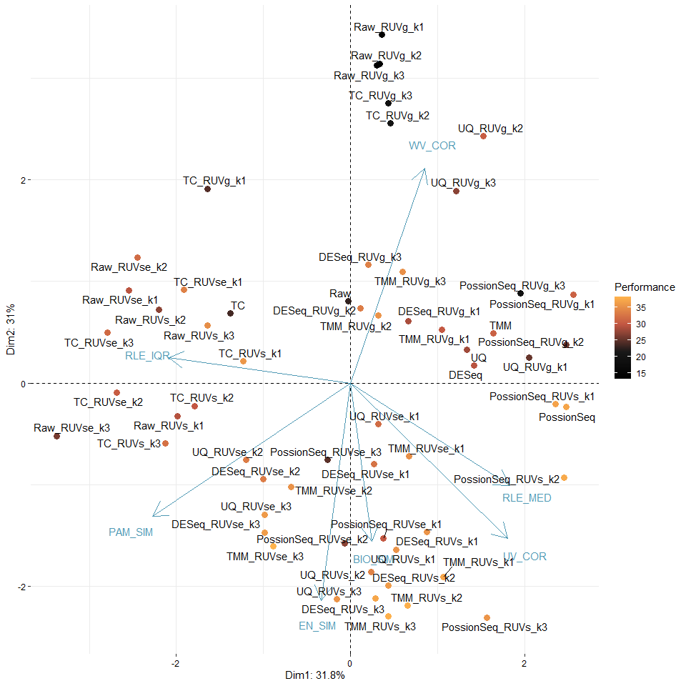
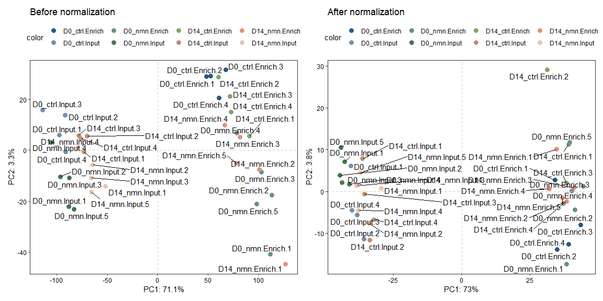

<!-- README.md is generated from README.Rmd. Please edit that file -->

# enONE

<!-- badges: start -->
<!-- badges: end -->

enONE is an R package for performing spike-in based normalization on
NAD-capped RNA sequencing data, as well as comparing and ranking the
performance of different normalization strategies. enONE also provides a
toolkit to handle NAD-RNA sequencing data.

## Installation

You can install the development version of enONE from
[GitHub](https://github.com/) with:

``` r
# install.packages("devtools")
devtools::install_github("thereallda/enONE")
```

## Workflow

``` r
library(enONE)
library(tidyverse)
library(edgeR)
library(paintingr)
library(patchwork)
library(SummarizedExperiment)
```

### Load data

Metadata including sample information.

``` r
meta <- read.csv('data/metadata.csv', comment.char = '#')
meta
#>     id       condition replicate
#> 1   C1   D0_ctrl.Input         1
#> 2   C2   D0_ctrl.Input         2
#> 3   C3   D0_ctrl.Input         3
#> 4   C5   D0_ctrl.Input         4
#> 5   C6  D14_ctrl.Input         1
#> 6   C7  D14_ctrl.Input         2
#> 7   C8  D14_ctrl.Input         3
#> 8  C10  D14_ctrl.Input         4
#> 9  C11  D0_ctrl.Enrich         1
#> 10 C12  D0_ctrl.Enrich         2
#> 11 C13  D0_ctrl.Enrich         3
#> 12 C15  D0_ctrl.Enrich         4
#> 13 C16 D14_ctrl.Enrich         1
#> 14 C17 D14_ctrl.Enrich         2
#> 15 C18 D14_ctrl.Enrich         3
#> 16 C20 D14_ctrl.Enrich         4
#> 17  N1    D0_nmn.Input         1
#> 18  N2    D0_nmn.Input         2
#> 19  N3    D0_nmn.Input         3
#> 20  N4    D0_nmn.Input         4
#> 21  N5    D0_nmn.Input         5
#> 22  N6   D14_nmn.Input         1
#> 23  N7   D14_nmn.Input         2
#> 24  N8   D14_nmn.Input         3
#> 25  N9   D14_nmn.Input         4
#> 26 N10   D14_nmn.Input         5
#> 27 N11   D0_nmn.Enrich         1
#> 28 N12   D0_nmn.Enrich         2
#> 29 N13   D0_nmn.Enrich         3
#> 30 N14   D0_nmn.Enrich         4
#> 31 N15   D0_nmn.Enrich         5
#> 32 N16  D14_nmn.Enrich         1
#> 33 N17  D14_nmn.Enrich         2
#> 34 N18  D14_nmn.Enrich         3
#> 35 N19  D14_nmn.Enrich         4
#> 36 N20  D14_nmn.Enrich         5
```

NAD-RNA-Sequencing data, with genes in rows and samples in columns.

``` r
counts.df <- read.csv('data/Counts.csv', row.names = 1)
counts.df[1:3,]
#>                    C1 C2 C3 C5 C6 C7 C8 C10 C11 C12 C13 C15 C16 C17 C18 C20 N1
#> ENSCAFG00845015183  0  0  0  0  0  0  0   0   0   0   0   0   0   0   0   0  0
#> ENSCAFG00845015195  0  0  0  0  0  0  0   0   0   0   0   0   0   0   0   0  0
#> ENSCAFG00845015208  0  0  0  0  0  0  0   0   0   0   0   0   0   0   0   0  0
#>                    N2 N3 N4 N5 N6 N7 N8 N9 N10 N11 N12 N13 N14 N15 N16 N17 N18
#> ENSCAFG00845015183  0  0  0  0  0  0  0  0   0   0   0   0   0   0   0   0   0
#> ENSCAFG00845015195  0  0  0  0  0  0  0  0   0   0   0   0   0   0   0   0   0
#> ENSCAFG00845015208  0  0  0  0  0  0  0  0   0   0   0   0   0   0   0   0   0
#>                    N19 N20
#> ENSCAFG00845015183   0   0
#> ENSCAFG00845015195   0   0
#> ENSCAFG00845015208   0   0
```

### Filtering low-expressed genes

``` r
keep <- filterByExpr(counts.df, group = meta$condition)
counts_keep <- counts.df[keep,]
dim(counts.df); dim(counts_keep)
#> [1] 48735    36
#> [1] 28795    36
```

### Create Enone object

Use “input.id” and “enrich.id” to specify the id of input and enrich
library, which should be the same as `group`. If `group` is
`c("D0_ctrl.Input", "D0_ctrl.Enrich",...)`, then `input.id` = ‘Input’
and `enrich.id` = ‘Enrich’.

`synthetic.id` is a vector specify the ids of synthetic RNA, if
included.

``` r
# set-up
enrich_group <- gsub(".*\\.", "", meta$condition)
spikeInPrefix <- '^FB'
# create Enone
Enone <- createEnone(data = counts_keep,
                     bio.group = meta$condition,
                     enrich.group = enrich_group,
                     batch.group = NULL,
                     spike.in.prefix = spikeInPrefix,
                     synthetic.id = c('Syn1','Syn2'),
                     input.id = "Input",
                     enrich.id = "Enrich"
                     )
Enone
#> class: Enone 
#> dim: 28795 36 
#> metadata(0):
#> assays(1): ''
#> rownames(28795): ENSCAFG00845015217 ENSCAFG00845015316 ... Syn1 Syn2
#> rowData names(3): GeneID SpikeIn Synthetic
#> colnames(36): C1 C2 ... N19 N20
#> colData names(5): id condition enrich replicate batch
```

Raw counts (sample + spike-in) can be accessed with

``` r
assay(Enone)[1:3,];dim(assay(Enone))
#>                      C1   C2   C3   C5   C6  C7   C8  C10 C11 C12 C13 C15 C16
#> ENSCAFG00845015217   17   23  158   16   14   9   95   11  14  12  67   9   8
#> ENSCAFG00845015316   56  108   88   86   47  63   47   49 125 136  93 102  36
#> ENSCAFG00845015457 1699 1671 1541 2866 1463 766 1455 1092 419 352 287 640 279
#>                    C17 C18 C20   N1   N2   N3   N4   N5  N6  N7  N8  N9  N10
#> ENSCAFG00845015217  35  78   7   15   99   99  122   89   8 103  92 114   94
#> ENSCAFG00845015316  64  91  92  108   88   78   69   78  43  45  65  70   89
#> ENSCAFG00845015457 327 351 262 1907 1914 1127 1113 1766 854 748 547 456 1145
#>                    N11 N12 N13 N14 N15 N16 N17 N18 N19 N20
#> ENSCAFG00845015217  18  30  58  41  41   3  62  35  62  55
#> ENSCAFG00845015316 168  75 100 146  75  39  30 102  68  71
#> ENSCAFG00845015457 269 279 151 189 386 162 263 158  90 360
#> [1] 28795    36
```

Sample information is stored in `colData`

``` r
colData(Enone)
#> DataFrame with 36 rows and 5 columns
#>              id      condition      enrich replicate       batch
#>     <character>    <character> <character> <numeric> <character>
#> C1           C1  D0_ctrl.Input       Input         1          NA
#> C2           C2  D0_ctrl.Input       Input         2          NA
#> C3           C3  D0_ctrl.Input       Input         3          NA
#> C5           C5  D0_ctrl.Input       Input         4          NA
#> C6           C6 D14_ctrl.Input       Input         1          NA
#> ...         ...            ...         ...       ...         ...
#> N16         N16 D14_nmn.Enrich      Enrich         1          NA
#> N17         N17 D14_nmn.Enrich      Enrich         2          NA
#> N18         N18 D14_nmn.Enrich      Enrich         3          NA
#> N19         N19 D14_nmn.Enrich      Enrich         4          NA
#> N20         N20 D14_nmn.Enrich      Enrich         5          NA
```

### Perform normalization and assessment

Normalization and assessment can be achieved by wrapper function `enONE`

``` r
Enone <- enONE(Enone, 
               ruv.norm = TRUE, ruv.k = 3,
               eval.pam.k = 2:6, eval.pc.n = 3,
               return.norm = FALSE,
               )
#> Gene set selection for normalization and assessment...
#> - The number of negative control genes for normalization: 1000 
#> - The number of positive evaluation genes: 500 
#> - The number of negative evaluation genes: 500 
#> Apply normalization...
#> Perform assessment...
```

Selected gene sets are stored in `rowData`, including:

- `NegControl`: Boolean value indicate whether this gene is a member of
  the negative control gene sets for RUV, default the most 1000 not
  enriched genes in spike_in are selected.
- `NegEvaluation`: Boolean value indicate whether this gene is a member
  of the negative evaluation gene set, default the most 500 not variable
  genes in samples are selected.
- `PosEvaluation`: Boolean value indicate whether this gene is a member
  of the positive evaluation gene set, default the most 500 enriched
  genes in samples are selected.

``` r
rowData(Enone)
#> DataFrame with 28795 rows and 6 columns
#>                                GeneID   SpikeIn Synthetic NegControl
#>                           <character> <logical> <logical>  <logical>
#> ENSCAFG00845015217 ENSCAFG00845015217     FALSE     FALSE      FALSE
#> ENSCAFG00845015316 ENSCAFG00845015316     FALSE     FALSE      FALSE
#> ENSCAFG00845015457 ENSCAFG00845015457     FALSE     FALSE      FALSE
#> ENSCAFG00845015550 ENSCAFG00845015550     FALSE     FALSE      FALSE
#> ENSCAFG00845015637 ENSCAFG00845015637     FALSE     FALSE      FALSE
#> ...                               ...       ...       ...        ...
#> FBgn0085753               FBgn0085753      TRUE     FALSE      FALSE
#> FBgn0267511               FBgn0267511      TRUE     FALSE      FALSE
#> FBgn0267505               FBgn0267505      TRUE     FALSE      FALSE
#> Syn1                             Syn1     FALSE      TRUE      FALSE
#> Syn2                             Syn2     FALSE      TRUE      FALSE
#>                    NegEvaluation PosEvaluation
#>                        <logical>     <logical>
#> ENSCAFG00845015217         FALSE         FALSE
#> ENSCAFG00845015316         FALSE         FALSE
#> ENSCAFG00845015457         FALSE         FALSE
#> ENSCAFG00845015550         FALSE         FALSE
#> ENSCAFG00845015637         FALSE         FALSE
#> ...                          ...           ...
#> FBgn0085753                FALSE         FALSE
#> FBgn0267511                FALSE         FALSE
#> FBgn0267505                FALSE         FALSE
#> Syn1                       FALSE         FALSE
#> Syn2                       FALSE         FALSE
```

You can get specific gene set by `getGeneSet`. Name of the gene set
provided must be the same as the column names of rowData.

``` r
getGeneSet(Enone, name = "NegControl")[1:5]
#> [1] "FBgn0267987" "FBgn0266906" "FBgn0031256" "FBgn0266032" "FBgn0031285"
```

Counts matrix can be accessed by `Counts`.

``` r
Counts(Enone, slot='sample', method='Raw')[1:3,]
#>                      C1   C2   C3   C5   C6  C7   C8  C10 C11 C12 C13 C15 C16
#> ENSCAFG00845015217   17   23  158   16   14   9   95   11  14  12  67   9   8
#> ENSCAFG00845015316   56  108   88   86   47  63   47   49 125 136  93 102  36
#> ENSCAFG00845015457 1699 1671 1541 2866 1463 766 1455 1092 419 352 287 640 279
#>                    C17 C18 C20   N1   N2   N3   N4   N5  N6  N7  N8  N9  N10
#> ENSCAFG00845015217  35  78   7   15   99   99  122   89   8 103  92 114   94
#> ENSCAFG00845015316  64  91  92  108   88   78   69   78  43  45  65  70   89
#> ENSCAFG00845015457 327 351 262 1907 1914 1127 1113 1766 854 748 547 456 1145
#>                    N11 N12 N13 N14 N15 N16 N17 N18 N19 N20
#> ENSCAFG00845015217  18  30  58  41  41   3  62  35  62  55
#> ENSCAFG00845015316 168  75 100 146  75  39  30 102  68  71
#> ENSCAFG00845015457 269 279 151 189 386 162 263 158  90 360
```

You can list all applied normalization methods by `listNormalization`.

``` r
listNormalization(Enone)
#>  [1] "TC"                  "UQ"                  "TMM"                
#>  [4] "DESeq"               "PossionSeq"          "Raw"                
#>  [7] "TC_RUVg_k1"          "TC_RUVs_k1"          "TC_RUVse_k1"        
#> [10] "TC_RUVg_k2"          "TC_RUVs_k2"          "TC_RUVse_k2"        
#> [13] "TC_RUVg_k3"          "TC_RUVs_k3"          "TC_RUVse_k3"        
#> [16] "UQ_RUVg_k1"          "UQ_RUVs_k1"          "UQ_RUVse_k1"        
#> [19] "UQ_RUVg_k2"          "UQ_RUVs_k2"          "UQ_RUVse_k2"        
#> [22] "UQ_RUVg_k3"          "UQ_RUVs_k3"          "UQ_RUVse_k3"        
#> [25] "TMM_RUVg_k1"         "TMM_RUVs_k1"         "TMM_RUVse_k1"       
#> [28] "TMM_RUVg_k2"         "TMM_RUVs_k2"         "TMM_RUVse_k2"       
#> [31] "TMM_RUVg_k3"         "TMM_RUVs_k3"         "TMM_RUVse_k3"       
#> [34] "DESeq_RUVg_k1"       "DESeq_RUVs_k1"       "DESeq_RUVse_k1"     
#> [37] "DESeq_RUVg_k2"       "DESeq_RUVs_k2"       "DESeq_RUVse_k2"     
#> [40] "DESeq_RUVg_k3"       "DESeq_RUVs_k3"       "DESeq_RUVse_k3"     
#> [43] "PossionSeq_RUVg_k1"  "PossionSeq_RUVs_k1"  "PossionSeq_RUVse_k1"
#> [46] "PossionSeq_RUVg_k2"  "PossionSeq_RUVs_k2"  "PossionSeq_RUVse_k2"
#> [49] "PossionSeq_RUVg_k3"  "PossionSeq_RUVs_k3"  "PossionSeq_RUVse_k3"
#> [52] "Raw_RUVg_k1"         "Raw_RUVs_k1"         "Raw_RUVse_k1"       
#> [55] "Raw_RUVg_k2"         "Raw_RUVs_k2"         "Raw_RUVse_k2"       
#> [58] "Raw_RUVg_k3"         "Raw_RUVs_k3"         "Raw_RUVse_k3"
```

Check the metrics of normalizations (ranked by scores in decreasing
order).

``` r
head(getMetrics(Enone))
#>                        BIO_SIM    EN_SIM BATCH_SIM   PAM_SIM      RLE_MED
#> TMM_RUVse_k3       0.004010675 0.3672915         0 0.7215727 0.0012331000
#> TMM_RUVs_k3        0.264969797 0.3526664         0 0.6917263 0.0013922471
#> TMM_RUVs_k2        0.273545725 0.3529028         0 0.6912465 0.0014106631
#> PossionSeq_RUVs_k2 0.162922204 0.3557378         0 0.6791057 0.0001844717
#> TMM_RUVs_k1        0.323222896 0.3572111         0 0.6832383 0.0017360384
#> DESeq_RUVs_k3      0.329558547 0.3506919         0 0.6919255 0.0022146643
#>                       RLE_IQR    WV_COR    UV_COR
#> TMM_RUVse_k3       0.02174805 0.8464516 0.3908795
#> TMM_RUVs_k3        0.02437620 0.6853092 0.1459999
#> TMM_RUVs_k2        0.02708899 0.7287250 0.1508830
#> PossionSeq_RUVs_k2 0.07336386 0.9182946 0.2784424
#> TMM_RUVs_k1        0.03318628 0.8619031 0.2170877
#> DESeq_RUVs_k3      0.02595740 0.7217122 0.1135383
```

Check the performance of normalizations (ranked by scores in decreasing
order). Higher score means better performance.

``` r
head(getScore(Enone))
#>                    BIO_SIM EN_SIM BATCH_SIM PAM_SIM RLE_MED RLE_IQR WV_COR
#> TMM_RUVse_k3            29     54         1      48      47      45     15
#> TMM_RUVs_k3             50     36         1      36      46      37      3
#> TMM_RUVs_k2             52     37         1      35      45      31      8
#> PossionSeq_RUVs_k2      43     43         1      17      59       7     43
#> TMM_RUVs_k1             55     47         1      25      39      22     19
#> DESeq_RUVs_k3           56     32         1      37      34      35      6
#>                    UV_COR    SCORE
#> TMM_RUVse_k3           29 38.14286
#> TMM_RUVs_k3            58 38.00000
#> TMM_RUVs_k2            57 37.85714
#> PossionSeq_RUVs_k2     50 37.42857
#> TMM_RUVs_k1            53 37.14286
#> DESeq_RUVs_k3          60 37.14286
```

#### PCA biplot

If batch not provided, preclude `BATCH_SIL` column and `SCORE` column.

``` r
enScore <- getScore(Enone)
pca.eval <- prcomp(enScore[,-c(3, 9)], scale = TRUE)
PCA_Biplot(pca.eval, score = enScore$SCORE)
```



You can turn on the interactive mode to further explore the performance
of each method.

``` r
PCA_Biplot(pca.eval, score = Enone@enone_score$SCORE, interactive = TRUE)
```

### Use suitable normalization

``` r
# select normalization
norm.method <- rownames(enScore[1,])
Enone <- UseNormalization(Enone, slot = 'sample', method = norm.method)
norm.data <- Counts(Enone, slot = 'sample', method = norm.method)
norm.factors <- getFactor(Enone, slot = 'sample', method = norm.method)
norm.method
#> [1] "TMM_RUVse_k3"
```

### Effect of normalization

we use PCA to visualize the counts from samples before and after the
normalization.

``` r
samples_name <- paste(Enone$condition, Enone$replicate, sep='.')
p1 <- PCAplot(log1p(Counts(Enone, slot='sample', 'Raw')), 
            color = Enone$condition,
            label = samples_name, vst.norm = FALSE) + ggtitle('Before normalization')
p2 <- PCAplot(log1p(norm.data), 
            color = Enone$condition,
            label = samples_name, vst.norm = FALSE) + ggtitle('After normalization')
p1 + p2
```



### FindEnrichment

You can find enriched genes by `FindEnrichment`.

Enriched genes are saved at slots `Enone@enrichment` (all) and
`Enone@enrichment_filtered` (filtered).

Default criteria for enriched genes is log2-Fold-Change
(enrichment/input) \>= 1 & adjusted p-value \< 0.05.

``` r
Enone <- FindEnrichment(Enone, slot='sample', method = norm.method, 
                        logfc.cutoff = 1, p.cutoff = 0.05)
# get filtered enrichment results
res.sig.ls <- getEnrichment(Enone, slot='sample', filter=TRUE)
unlist(lapply(res.sig.ls, nrow))
#>   D0_ctrl.Enrich_D0_ctrl.Input D14_ctrl.Enrich_D14_ctrl.Input 
#>                           2167                           2102 
#>     D0_nmn.Enrich_D0_nmn.Input   D14_nmn.Enrich_D14_nmn.Input 
#>                           2688                           2402
```

Each enrichment table is a `data.frame` with a list of genes as rows,
and associated information as columns (GeneID, logFC, p-values, etc.).
The following columns are present in the table:

- `GeneID`: ID of genes.
- `logFC`: log2 fold-change between enrichment and input samples.
  Positive values indicate that the gene is more highly enriched in the
  enrichment group.
- `logCPM`: log2 CPM (counts per million) of the average expression of
  all samples.
- `LR`: Likelihood ratio of the likelihood ratio test.
- `PValue`: p-value from the likelihood ratio test.
- `FDR`: False discovery rate of the p-value, default “BH” method is
  applied.

``` r
head(res.sig.ls[[1]])
#>               GeneID    logFC    logCPM       LR        PValue           FDR
#> 1 ENSCAFG00845007784 2.959802  8.717648 509.4189 8.484765e-113 1.231648e-108
#> 2 ENSCAFG00845002083 3.157457 12.584706 375.8864  9.784997e-84  7.101951e-80
#> 3 ENSCAFG00845009430 2.510118  7.642940 340.5231  4.908601e-76  2.375108e-72
#> 4 ENSCAFG00845000887 2.287440  7.351301 299.2720  4.746529e-67  1.722515e-63
#> 5 ENSCAFG00845007809 3.177614  6.102379 295.1592  3.736355e-66  1.084738e-62
#> 6 ENSCAFG00845016135 2.327771  9.398165 293.5746  8.273551e-66  2.001648e-62
```

Reduce list of enrichment and visualize with violin-box plot.

``` r
nad_df1 <- reduceRes(res.sig.ls, logfc.col = 'logFC')
nad_df1$Group <- gsub('\\..*', '', nad_df1$Group)
nad_df1$Group <- factor(nad_df1$Group, levels = unique(nad_df1$Group))
bxp1 <- BetweenStatPlot(nad_df1, x='Group', y='logFC', color='Group', 
                        step.increase = 0.6, add.p = 'p')
bxp1
```


save data

``` r
save(Enone, file='data/Enone.RData')
```

## Handling spike-in

Normalization for counts from spike-in.

``` r
Enone <- UseNormalization(Enone, slot="spike_in", method=norm.method)
```

And we can find enriched genes for spike-in.

``` r
Enone <- FindEnrichment(Enone, slot='spike_in', method = norm.method, 
                        logfc.cutoff = 1, p.cutoff = 0.05)
# get filtered enrichment results
res.spikein.ls <- getEnrichment(Enone, slot='spike_in', filter=TRUE)
unlist(lapply(res.spikein.ls, nrow))
#>   D0_ctrl.Enrich_D0_ctrl.Input D14_ctrl.Enrich_D14_ctrl.Input 
#>                           2044                           2154 
#>     D0_nmn.Enrich_D0_nmn.Input   D14_nmn.Enrich_D14_nmn.Input 
#>                           2084                           1980
```

Likewise, enriched genes from spike-in can be visualized with
`BetweenStatPlot`

``` r
nad_df2 <- reduceRes(res.spikein.ls, logfc.col = 'logFC')
nad_df2$Group <- gsub('\\..*', '', nad_df2$Group)
nad_df2$Group <- factor(nad_df2$Group, levels = unique(nad_df2$Group))
bxp2 <- BetweenStatPlot(nad_df2, x='Group', y='logFC', color='Group', 
                        step.increase = 0.6, add.p = 'p')
bxp2
```


## Handling synthetic RNA

You can calculate the enrichment of synthetic RNA, if provided, using
`synEnrichment`. By default, it return enrichment level of synthetic RNA
after normalization by “TC”.

``` r
synEnrichment(Enone)
#>             C11        C12        C13        C15       C16       C17        C18
#> Syn1  3.1445149  3.0556877  3.3446099  3.3647074  3.229864 3.2820948  3.3516701
#> Syn2 -0.6228232 -0.5530273 -0.4326226 -0.4529038 -0.410781 0.2196065 -0.4113922
#>             C20        N11        N12        N13        N14         N15
#> Syn1  3.4897014  3.0351266  2.8620914  2.7868611  2.8485971  2.82069423
#> Syn2 -0.5708432 -0.5039453 -0.7790745 -0.3796704 -0.3358998 -0.09417245
#>             N16        N17        N18        N19        N20
#> Syn1  2.8462100  3.0155334  2.9511332  2.9144086  3.0072205
#> Syn2 -0.7515145 -0.2863579 -0.1185875 -0.1493189 -0.0683519
```

Or use “TMM_RUVse_k3”

``` r
synEnrichment(Enone, method=norm.method)
#>             C11       C12        C13       C15       C16        C17        C18
#> Syn1  1.8779026  1.830769  2.0822951  1.954577  2.118178 2.46066199  2.1739701
#> Syn2 -0.4668758 -0.465956 -0.3319655 -0.385002 -0.345663 0.09298064 -0.3170932
#>            C20         N11        N12          N13        N14       N15
#> Syn1  2.101352  2.24788306  2.2205275  2.177430605  1.8692839 2.1546966
#> Syn2 -0.466793 -0.06014786 -0.2154541 -0.004751993 -0.1540691 0.1487517
#>             N16        N17         N18        N19        N20
#> Syn1  1.9731376  2.2768137  1.99907002  1.9448659 2.12529094
#> Syn2 -0.3770841 -0.0271773 -0.05731098 -0.1014316 0.03365334
```

Compared to “TC”, “TMM_RUVse_k3” gave enrichment level with less
variation

``` r
apply(synEnrichment(Enone), 1, sd); apply(synEnrichment(Enone, method=norm.method), 1, sd)
#>      Syn1      Syn2 
#> 0.2202541 0.2563932
#>      Syn1      Syn2 
#> 0.1640549 0.2047313
```

synthetic RNA enrichment levels can be visualized with dot plot

``` r
syn_level <- synEnrichment(Enone, method=norm.method, log=TRUE)
syn_df <- as.data.frame(syn_level) %>% 
  rownames_to_column("syn_id") %>% 
  pivot_longer(cols = -syn_id,
               names_to = "id",
               values_to = "logFC") %>% 
  left_join(meta[,c("id","condition")], by="id")
# remove suffix of condition
syn_df$condition <- gsub("\\..*", "", syn_df$condition)

DotPlot(syn_df, x="condition", y="logFC", fill="condition") +
  facet_wrap(~syn_id)
#> Bin width defaults to 1/30 of the range of the data. Pick better value with `binwidth`.
```


