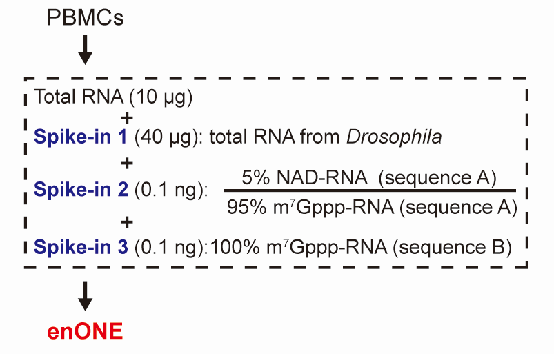

```{r, include = FALSE}
knitr::opts_chunk$set(
  collapse = TRUE,
  comment = "#>"
)
```

## Introduction

The hub metabolite, nicotinamide adenine dinucleotide (NAD), can be used as an initiating nucleotide in RNA transcription to result in NAD-capped RNAs (NAD-RNAs). Epitranscriptome-wide profiling of NAD-RNAs involves chemo-enzymatic labeling and affinity-based enrichment; yet currently available computational analysis cannot adequately remove variations inherently linked with capture procedures. Here, we propose a spike-in-based normalization and data-driven evaluation framework, `enONE`, for the omic-level analysis of NAD-capped RNAs.

`enONE` package is implemented in R and publicly available at <https://github.com/thereallda/enONE>.

## Setup

For this tutorial, we will demonstrate the `enONE` workflow by using a NAD-RNA-seq data from human peripheral blood mononuclear cells (PBMCs).

Notably, we included three types of spike-in RNAs:

1.  Total RNAs from *Drosophila melanogaster*, an invertebrate model organism with well-annotated genome sequence, for estimating the unwanted variation;
2.  Synthetic RNAs, consisting of 5% NAD- relative to m7G-capped forms, were used to determine the capture sensitivity;
3.  Synthetic RNAs, with 100% m7G-capped forms, were used to determine the capture specificity (Figure1 below).



*Figure 1: Schematic workflow for total RNAs from PBMCs and three sets of spike-ins.*

We start by reading in the data, including count matrix and metadata. It is recommended to provide the assay group of samples with the `assay` column in metadata.

```{r,warning=FALSE,message=FALSE}
library(enONE)
library(tidyverse)
library(patchwork)

# read in metadata and counts matrix
counts_mat <- read.csv("data/Counts.csv", row.names = 1)
meta <- read.csv("data/metadata.csv", comment.char = "#")
head(meta)
```

Next, we use the count matrix to create a `Enone` object.

The `Enone` object serves as a container that contains both data (raw and normalized counts data) and analysis (e.g., normalization performance evaluation score and enrichment results) for a NAD-RNA-seq dataset.

When constructing `Enone` object, we can provide following arguments:

-   Prefix of spike-in genes (`spike.in.prefix = "^FB"`);

-   The id of synthetic spike-in (`synthetic.id = c("Syn1", "Syn2")`), same with row names in `counts_mat`;

-   The id of input (`input.id = "Input"`) and enrichment (`enrich.id = "Enrich"`), same as the assay column.

> Here, "Syn1" represent the spike-in with 5% NAD-RNA and "Syn2" is the spike-in with 100% m7G-RNA.
>
> **Notably, `batch.group` , `synthetic.id` are optional.**

```{r}
# prefix of Drosophila spike-in genes
spikeInPrefix <- "^FB"

# create Enone
Enone <- createEnone(data = counts_mat,
                     bio.group = meta$condition,
                     enrich.group = meta$assay,
                     batch.group = meta$batch,
                     spike.in.prefix = spikeInPrefix,
                     synthetic.id = c("Syn1", "Syn2"), 
                     input.id = "Input",
                     enrich.id = "Enrich"
                     )
Enone
```

## Standard workflow

The `enONE` workflow consists of four steps:

1.  Quality control;
2.  Gene set selection;
3.  Normalization procedures;
4.  Normalization performance assessment.

### Quality Control

`enONE` initiate with quality control step to filter lowly-expressed genes. This step is performed with `FilterLowExprGene` by keeping genes with at least `min.count` in at least n samples. n is determined by the smallest group sample size specifying in `group` .

```{r}
Enone <- FilterLowExprGene(Enone, group = Enone$condition, min.count = 20)
Enone
```

Additionally, outliers can be assessed and further removed (if `return=TRUE`) by `OutlierTest`. Since no sample is flagged as outlier, we will use all samples in following analysis.

```{r}
## ronser"s test for outlier assessment
OutlierTest(Enone, return=FALSE)
```

### Running enONE

The main `enONE` function can be used to perform gene selection, normalization, and evaluation. This function return selected gene set in `rowData`, normalized count matrix in `counts` slot (when `return.norm=TRUE`), normalization factors (`enone_factor` slot), evaluation metrics and scores in `enone_metrics` and `enone_scores` slots, respectively. Detailed of these steps are described bellow.

```{r}
Enone <- enONE(Enone, 
               scaling.method = c("TC", "UQ", "TMM", "DESeq", "PossionSeq"),
               ruv.norm = TRUE, ruv.k = 3,
               eval.pam.k = 2:6, eval.pc.n = 3, 
               return.norm = TRUE
               )
```

#### Gene set Selection

For gene set selection, enONE defined three sets of control genes, including:

-   Negative Control (`NegControl`): By default, `enONE` define the 1,000 least significantly enriched genes in *Drosophila* spike-ins (or other RNA spike-in from exogenous organism), ranked by FDR, as the negative controls for adjustment of the unwanted variations.

-   Negative Evaluation (`NegEvaluation`): By default, `enONE` define the 500 least significantly varied genes in samples of interest, ranked by FDR, as negative evaluation genes for evaluation of the unwanted variations.

-   Positive Evaluation (`PosEvaluation`): By default, `enONE` define the 500 most significantly enriched genes in samples of interest, ranked by FDR, as positive evaluation genes for evaluation of the wanted variations.

Gene set selection can either be automatically defined in `enONE` function with `auto=TRUE` parameter (default), or be provided in `neg.control, pos.eval, neg.eval` parameters, respectively.

Selected gene sets can be assessed by `getGeneSet` with the name of gene set (i.e., `"NegControl"`, `"NegEvaluation"`, `"PosEvaluation"`).

```{r}
getGeneSet(Enone, "NegControl")[1:5]
```

#### Normalization

`enONE` implements global scaling and regression-based methods for the generation of normalization procedures.

For the global scaling normalization procedures, five different scaling procedures are implemented, including

1.  Total Count (TC);

2.  Upper-Quartile (UQ);

3.  Trimmed Mean of M Values (TMM);

4.  DESeq;

5.  PossionSeq.

    By default, enONE uses all scaling methods, while user can perform with selected scaling procedures in `scaling.method` parameter.

For the regression-based procedures, `enONE` use three variants of RUV to estimate the factors of unwanted variation, including

1.  RUVg;

2.  RUVs;

3.  RUVse.

    For instance, you can perform RUV with selected the first two unwanted factors with `ruv.norm=TRUE, ruv.k=2`.

> RUVse is a modification of RUVs. It estimated the factors of unwanted variation based on negative control genes from the replicate samples in each assay group (i.e., enrichment and input), for which the enrichment effect was assumed to be constant.

All applied normalization methods can be assessed by `list`

```{r}
listNormalization(Enone)
```

Normalized counts can be assessed by `Counts`

```{r}
head(Counts(Enone, slot="sample", method="DESeq_RUVg_k2"))[,1:5]
```

#### Evaluation

To evaluate the performance of normalization, `enONE` leverages eight normalization performance metrics that related to different aspects of the distribution of gene expression measures. The eight metrics are listed as below:

1.  `BIO_SIM`: Similarity of biological groups. The average silhouette width of clusters defined by `bio.group`, computed with the Euclidean distance metric over the first 3 expression PCs (default). Large values of `BIO_SIM` is desirable.

2.  `EN_SIM`: Similarity of enrichment groups. The average silhouette width of clusters defined by `en.group`, computed with the Euclidean distance metric over the first 3 expression PCs (default). Large values of `EN_SIM` is desirable.

3.  `BAT_SIM`: Similarity of batch groups. The average silhouette width of clusters defined by `batch.group`, computed with the Euclidean distance metric over the first 3 expression PCs (default). Low values of `BAT_SIM` is desirable.

4.  `PAM_SIM`: Similarity of PAM clustering groups. The maximum average silhouette width of clusters defined by PAM clustering (cluster by `eval.pam.k`), computed with the Euclidean distance metric over the first 3 expression PCs (default). Large values of `BAT_SIM` is desirable.

5.  `WV_COR`: Preservation of biological variation. R^2^ measure for regression of first 3 expression PCs on first `eval.pc.n` PCs of the positive evaluation genes (`PosEvaluation`) sub-matrix of the raw count. Large values of `WV_COR` is desirable.

6.  `UV_COR`: Removal of unwanted variation. R^2^ measure for regression of first 3 expression PCs on first `eval.pc.n` PCs of the negative evaluation genes (`NegEvaluation`) sub-matrix of the raw count. Low values of `UV_COR` is desirable.

7.  `RLE_MED`: The mean squared-median Relative Log Expression (RLE). Low values of `RLE_MED` is desirable.

8.  `RLE_IQR`: The variance of inter-quartile range (IQR) of RLE. Low values of `RLE_IQR` is desirable.

Evaluation metrics can be assessed by `getMetrics`

```{r}
getMetrics(Enone)[1:5,]
```

Evaluation score is the average rank of each performance metrics, which can be assessed by `getScore`

```{r}
getScore(Enone)[1:5,]
```

## Select the suitable normalization for subsequent analysis

`enONE` provides biplot to exploit the full space of normalization methods, you can turn on the interactive mode with `interactive=TRUE`.

```{r, fig.width=10, fig.height=10}
# get performance score
enScore <- getScore(Enone)
# perform PCA based on evaluation score, excluding BAT_SIM column (3) if no batch information provided, and SCORE column (9).
# pca.eval <- prcomp(enScore[,-c(3, 9)], scale = TRUE)
pca.eval <- prcomp(enScore[,-c(9)], scale = TRUE)
# pca biplot
PCA_Biplot(pca.eval, score = enScore$SCORE, interactive = FALSE)
```

In this plot, each point corresponds to a normalization procedure and is colored by the performance score (mean of eight scone performance metric ranks). The blue arrows correspond to the PCA loadings for the performance metrics. The direction and length of a blue arrow can be interpreted as a measure of how much each metric contributed to the first two PCs

Here, we use the top-ranked procedure DESeq_RUVs_k3 for downstream analysis.

```{r}
# select normalization
norm.method <- rownames(enScore[1,])

# get normalized counts
norm.data <- Counts(Enone, slot = "sample", method = norm.method)

# get normalization factors
norm.factors <- getFactor(Enone, slot = "sample", method = norm.method)

norm.method
```

> To be noted, if normalized counts are not returned in `enONE` run step (i.e., `return.norm=FALSE`), you can manually perform the normalization method, e.g.,
>
> ```{r, eval=FALSE}
> # perform normalization
> Enone <- UseNormalization(Enone, slot = "sample", method = norm.method)
> # get normalized counts
> norm.data <- Counts(Enone, slot = "sample", method = norm.method)
> ```

## Effect of normalization

We perform PCA based on the count matrix from sample of interest before and after the normalization, for demonstrating the effect of normalization.

```{r, fig.width=12, fig.height=6}
# create sample name, e.g., Y3.Input
samples_name <- paste(Enone$condition, Enone$replicate, sep=".")

# PCA for raw count
p1 <- PCAplot(Counts(Enone, slot="sample", "Raw"), 
            color = Enone$batch,
            shape = Enone$enrich,
            label = samples_name, 
            vst.norm = TRUE) + 
  ggtitle("Before normalization")

# PCA for normalized count
p2 <- PCAplot(log1p(norm.data), 
            color = Enone$batch,
            shape = Enone$enrich,
            label = samples_name, 
            vst.norm = FALSE) + 
  ggtitle("After normalization")

# combine two plots
p1 + p2
```

## Find enrichment

`enONE` package can help you find enrichment genes from each biological groups via differential expression. It can identify genes that significantly increased in enrichment samples compared to input samples.

`FindEnrichment` automates this processes for all groups provided in `bio.group`.

By default, enriched genes (NAD-RNA in here) are defined as fold change of normalized transcript counts ≥ 2 (`logfc.cutoff = 1`), FDR \< 0.05 (`p.cutoff = 0.05`) in enrichment samples compared to those in input samples.

Use `getEnrichment` to retrieve a list of enrichment result tables.

```{r}
# find all enriched genes
Enone <- FindEnrichment(Enone, slot="sample", method = norm.method, 
                        logfc.cutoff = 1, p.cutoff = 0.05)

# get filtered enrichment results
res.sig.ls <- getEnrichment(Enone, slot="sample", filter=TRUE)

# count number of enrichment in each group
unlist(lapply(res.sig.ls, nrow))
```

Each enrichment table is a `data.frame` with a list of genes as rows, and associated information as columns (GeneID, logFC, p-values, etc.). The following columns are present in the table:

-   `GeneID`: ID of genes.
-   `logFC`: log2 fold-change between enrichment and input samples. Positive values indicate that the gene is more highly enriched in the enrichment group.
-   `logCPM`: log2 CPM (counts per million) of the average expression of all samples.
-   `LR`: Likelihood ratio of the likelihood ratio test.
-   `PValue`: p-value from the likelihood ratio test.
-   `FDR`: False discovery rate of the p-value, default "BH" method is applied.

```{r}
head(res.sig.ls[[1]])
```

To convert list of enrichment result tables into data frame in long format, `enONE` package provide `reduceRes` function for this task. Finally, you can use `BetweenStatPlot` to compare the global extent of NAD-RNA modification level between groups.

```{r}
# simplify group id
names(res.sig.ls) <- c("Young", "Mid", "Old")

# logfc.col specify the name of logFC column
nad_df1 <- reduceRes(res.sig.ls, logfc.col = "logFC")

# convert the Group column as factor
nad_df1$Group <- factor(nad_df1$Group, levels = unique(nad_df1$Group))

# draw plot
bxp1 <- BetweenStatPlot(nad_df1, x="Group", y="logFC", color="Group", 
                        step.increase = 0.6, add.p = "p", 
                        comparisons = list(c("Young", "Mid"), 
                                           c("Young", "Old")))
bxp1
```

## Handling synthetic spike-in RNA

Since synthetic RNAs, of which one with 5% NAD-caps and another with 100% m7G-caps, are included, we can use these spike-ins to determine the capture sensitivity and specificity.

`synEnrichment` calculate the enrichment levels of synthetic spike-ins with given normalization method. `DotPlot` can be used to visualize the enrichment levels of synthetic spike-in.

```{r}
# compute synthetic spike-in enrichment
syn_level <- synEnrichment(Enone, method=norm.method, log=TRUE)

# transform to long format
syn_df <- as.data.frame(syn_level) %>% 
  rownames_to_column("syn_id") %>% 
  pivot_longer(cols = -syn_id,
               names_to = "id",
               values_to = "logFC") %>% 
  left_join(meta[,c("id","condition")], by="id")

# remove suffix of condition for simplification
syn_df$condition <- gsub("\\..*", "", syn_df$condition)

# rename facet label
samples_label <- setNames(c("5% NAD-RNA", "100% m7G-RNA"), 
                          nm=c("Syn1", "Syn2"))

# draw dotplot
DotPlot(syn_df, x="syn_id", y="logFC", fill="syn_id") +
  theme(legend.position = "none") +
  scale_x_discrete(labels=samples_label)
```

Syn1, which contained 5% NAD-RNA, are significantly enriched, whereas no enrichment is found for Syn2 made up with 100% m7G-RNA.

```{r,eval=FALSE}
# save Enone data
save(Enone, file="data/Enone.RData")
```

## Session Info

<details>

<summary>**Session Info**</summary>

```{r}
sessionInfo()
```

</details>
